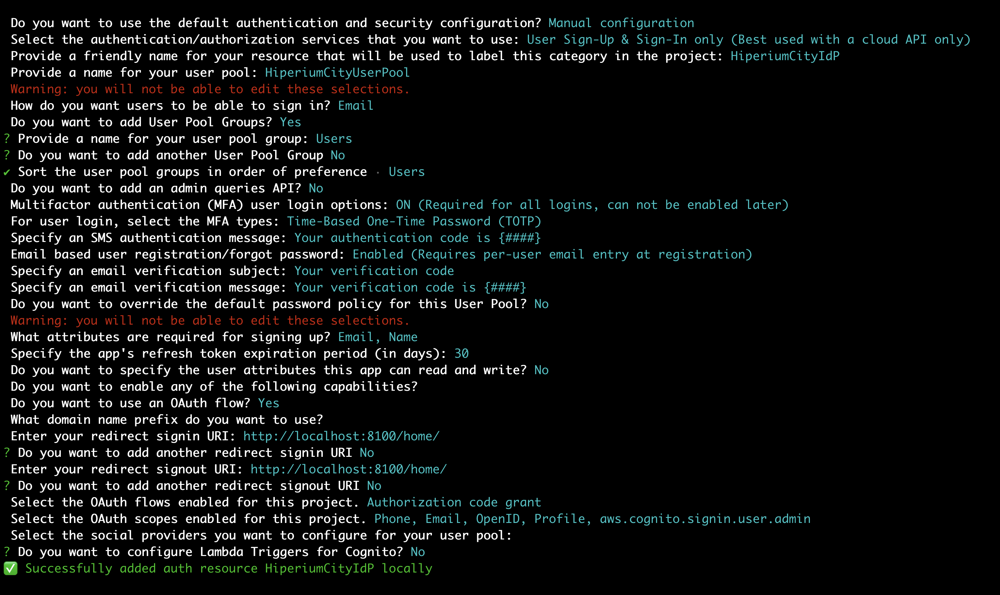

## Hiperium City IdP Service: IdP using AWS Cognito for Organization Users for the IAM Identity Center.

* **Author**: [Andres Solorzano](https://www.linkedin.com/in/aosolorzano/).
* **Level**: Intermediate.
* **Technologies**: AWS Amplify and Cognito.

---

## Project's details on Medium.com
You can follow the last project's details on my [Medium blog](https://aosolorzano.medium.com). If you want to see the last details, you can read the following articles:
* OpenID Connect and OAuth 2.0 for AWS Organizations: [blog](https://aosolorzano.medium.com/implementing-sso-with-amazon-cognito-as-an-identity-provider-idp-38d8e1d4c98d).
* Implementing Multi-Account Environment on AWS using IAM Identity Service: [blog](https://aosolorzano.medium.com/implementing-a-multi-account-environment-with-aws-organizations-and-the-iam-identity-center-d1cdb40bdf4d).

---

## Requirements
1. An AWS account.
2. [Git](https://git-scm.com/downloads).
3. [AWS CLI](https://docs.aws.amazon.com/cli/latest/userguide/getting-started-install.html).
4. [Amplify CLI](https://docs.amplify.aws/cli/start/install).

---

## Deploying Cognito IdP using Amplify
Execute the following command at the project's root directory:
```bash
amplify init
```
Then, execute the following command to add the Cognito Auth service:
```bash
amplify add auth
```
The following image shows an example of the Cognito Auth configuration using the Amplify CLI:


Finally, deploy the Cognito IdP configuration to AWS:
```bash
amplify push
```

Download the latest changes from the Tasks Service repository to test the Cognito IdP configuration:
```bash
git clone https://github.com/hiperium/hiperium-city-tasks.git
```
Then, execute the following command to deploy the Tasks Service to AWS:
```bash
sh ./run-scripts.sh
```

You can follow the documentation of the Tasks Service in its GitHub repository.
